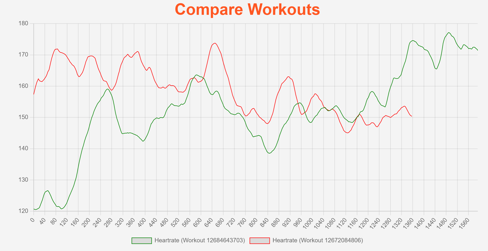

# strv-cmpr

This is a fully functional web app that will authorize user with their Strava account using OAuth2.0 and then display their workouts. From the list of workouts, the user can select two workouts to compare. The compare page will display charts comparing: heart rate, pace and cadence between the two workouts. The app is deployed to a free render.com instance and can be accessed at [strv-cmpr.onrender.com](https://strv-cmpr.onrender.com/).

The intention for this project was to see how good the latest GPT4o model was.
It took me *3h 30m* to build the app all the way from the initial setup to the final deployment.
I was blown away by the intiall version of the app. As GPT4o was able to create the main page with OAuth2.0 authorization and fetching and displaying the workouts. I did not have to make any changes and the app worked out of the box. It even ceated the app icon and styles that matched the Strava theme.

Unfortunately, as I was asking the GPT4o model to add more functionality it would start breaking the already working functionality and wasn't able to fix its own bugs. I had to restore to guiding it through the process with small changes and applying them one by one. In the end we ended up with a working web app, which is both impressing and disappointing at the same time.

## Workouts

## Compare

